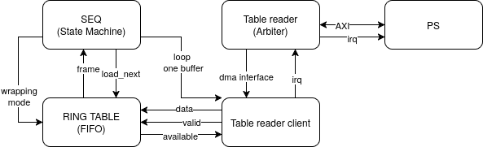
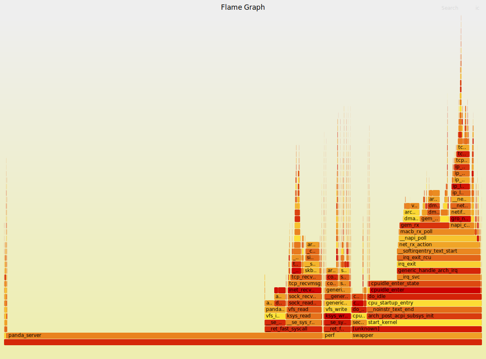

# Pandablocks-server issue 61: Support a streaming table

## Requirements
- [x] Req 1: There should be 2 modes

  FIXED mode: only one table is sent and it is possible to repeat

  STREAMING mode: more than one table can be pushed.

- [x] Req 2: In streaming mode, while an instance is using a table, we should be
able to push the next table or tables.
- [x] Req 3: The sequencer block should be able to run at 1MHz, this means the DMA
  and the socket to send the table data should be able to sustain at least
  16 MB/s (approx 15.26MiB/s).
- [x] Opt 4: In fixed mode, small tables (say < 4K entries) can run at 1
entry per tick.
- [x] Req 5: In fixed mode, we should be able to reuse the last buffer sent
  without requiring to reset and restart the DMA engine.
- [x] Req 6: In the server interface, entering the fixed mode is done by
  sending a table with `<` character, e.g.

```
  PGEN1.TABLE<
 1 
 2
 3
 ```

- [x] Req 7: In the server interface, entering the streaming mode is done by
sending a table with `<<` characters and sending the last table with `<<|`
characters, e.g.
```
PGEN1.TABLE<<
1
2

PGEN1.TABLE<<|
3
4

```

- [x] Req 8: the append mode is fully removed (at least in long tables).
- [x] Req 9: the server should expose some field to indicate the progress on
  consumption of the data, current proposal `<block>.TABLE.QUEUED_LINES?`
  indicates how many lines are in the queue plus the ones been currently used
  in the FPGA.
- [x] Req 10: the server should expose the current mode, e.g.
  `<block>.TABLE.MODE`, it could have one of the following values:
  INIT (it needs initialization), FIXED (fixed mode), STREAMING
  (streaming mode), STREAMING_LAST (the last buffer of the stream was queued).
- [x] Req 11: DMA overrun and underrun should be detected and shown in the
  HEALTH register, following attempts to push table data should error.
- [x] Req 12: Reading a streaming table from the server should return an empty
  table.
- [x] Req 13: In streaming mode, a explicit table reset is required to change
  to a different mode. This is to ensure a script pushing the tables is aware of
  the end condition.
- [x] Req 14: Transition from fixed mode to fixed mode (with different data) or
  to streaming mode is allowed without requiring an explicit reset (the server
  will be doing the table reset automatically under the hood).
- [x] Req 15:  `<block>.TABLE>QUEUED_LINES` must be included in the change set
  (to get notified by `*CHANGES?`).

## Design
### FPGA

- The instance in the FPGA will interrupt the CPU on two events: when it just
became ready to accept a new table in streaming mode or when it has used all
the buffers so the driver can free resources.
- `wrapping_mode` and `loop_one_buffer` are signals to implement an optimization
to allow reusing the fifo as a table, this is to do with point "Opt 4" in
requirements.

### Server
- The driver now has to handle a new interrupt and do the required processing,
on ready condition, it should check the queue to push the next table, on
completion condition, it should free all buffers.
- Pushing the data to the driver is done via a new ioctl command, this is
  because the write syscall doesn't allow passing flags which we need to
  indicate if it is the last buffer.

## Implementation notes
- MA suggested that the part handling the DMA shouldn't know the REPEATS, even
  if that means spending more block ram.
- MA suggested to preallocate DMA buffers instead of doing it on demand, even if
  that means having a smaller maximum number of buffers allocated.
- How many buffers? and what's the best size? I used the maximum possible size
  using the page allocator 4MB, unfortunately, some targets like ZedBoard don't
  have too many of those buffers available, so I set the number of buffers to 8
  per instance, which would allow having 2 seconds worth of data at maximum
  speed (see Req 3).
- Once a streaming run finishes, in order to restart the instance, you need to
  clear the table, the reason why this is not done automatically (or on disable)
  is that the script doing the table pushing should be aware of the end condition
  (either by error or gracefully).
- Sequence of events while sending a table:
  - User sends a table to the server with `<`, `<<` or `<<|` depending on the
    desired mode.
  - Server pushes it to the driver.
  - If hardware block is not busy, driver pushes it to hardware, otherwise, it
    is queued.
  - If there is a ready interrupt, the driver will push the buffer from the
    queue.
  - If there is a completion interrupt, the driver will free the buffers left.
- After implementing all the requirements I found I got timing failed while
  building PandABox-no_fmc, at first I found the critical paths were in the
  blocks I was working with, but after doing some optimizations, the critical
  paths were not in those blocks anymore and timing was still failing,
  mainly because of congestion (overused of the FPGA)... so I decided to reduce
  the number of instances for the following blocks: SEQ=2, PGEN=1, SYNC=1 ...
  and after that, timing was finally (barely) passing. However, CI showed some
  other applications failing and I had to fully remove PGEN.
- TC suggested to put back SYNC=2 and it seems to be working fine.

## Testing
- The cocotb timing tests were extracted from `cocotb` branch in
  PandABlocks-FPGA, this was to speed up the dev-test cycle.
- Development tests were added in the folder `dev-tests`
- Scripts to facilitate hardware testing are in `hardware-tests`
It is important to note that tables are pushed using base64 encoding to reduce
bandwidth required, similarly, pcap is used to validate data using unframed raw
mode.

- ZedBoard: PGEN test sending 5096x4MB buffers at 2.5MHz per line:
```bash
./hardware-tests/pgen.py --lines-per-block 1048576 --start-number 0 --clock-period-us 0.4 --nblocks 5096 192.168.0.1
Lines per block 1048576
Number of blocks 5096
Clock period 0.4 us
Bandwidth 9.537 MB/s
Total size 20384.000 MB
Pushing table 0 from 0 to 1048575
time to push table 0: 0.11306047439575195
Pushing table 1 from 1048576 to 2097151
time to push table 1: 0.2505371570587158
...
Checked 5343543296 lines
```
The test worked successfully, sending ~20.3GB of table data.

- I detected memory leaks after long use. I investigated further and found that
  if there is an error (e.g. DMA underrun) and I keep sending buffers, those
  buffers were not freed, I found the bug in the driver and fixed it.

- I found a mistake, I was setting the clock period in seconds, but the server
  thinks the FPGA is clocked at 125MHz, which is wrong as I under-clocked to
  50MHz for my tests. This means the test above was triggering 40% slower than 
  I thought.

  I changed the script to accept a fpga-freq parameter so that I can set the
  clock period using ticks instead. I did a quick test to find the fastest
  triggering, and it's 0.25us, I expect when I repeat the test with pandabox, it
  will be faster, because it will have a faster NIC and also because it is
  not under-clocked.

- I got timing errors in my last build for Pandabox after implementing all the
  requirements. I will analyze the reports in Vivado to optimize timing.

## Performance analysis

### Perf report
- `perf` was built and manually copied to the target, to do this, I added the
  following target to rootfs:
```
perf:
	$(EXPORTS) KBUILD_OUTPUT=$(KERNEL_BUILD) $(MAKE) -j 12 -C $(KERNEL_SRC)/tools/perf
```
Then manually copied the result from the built directory.
- Some compiler options were added, the following is an excerpt from the server
  mafile:

```
ifdef DEBUG
CFLAGS += -O0 -g -fomit-frame-pointer
endif
```
Then I built using: `make DEBUG=1`
- Perf was run while I was doing the streaming tests:
```bash
perf record -F 999 -a -g --call-graph dwarf -- sleep 10
perf script > /tmp/out.perf
```
- The flamegraph was generated with the following commands:
```bash
scp panda:/tmp/out.perf .
perl src/FlameGraph/stackcollapse-perf.pl out.perf > out.folded
perl src/FlameGraph/flamegraph.pl out.folded > perf-flamegraph.svg
```
- Flamegraph 1: while pushing 10 buffers

It turned out, the bottleneck was ethernet, for some reason, I can only push
around 12MB/s to the ZedBoard over the ethernet link, I will re-try the same
test on a Pandabox (which shouldn't have that limitation).

### ILA report
- A system integrated logic analyser was added to verify the AXI transactions.
- Observations:
From end of last burst to start of next burst it takes 22 cycles.
Given that there is an arbiter, this number depends on the number of dma
instances, in this specific case, there were 2 of them.

If we consider maximum bursts, this provides an utilization of 92%, at 125MHz,
the maximum bandwidth would be around 460MB/s.
Considering that in practice, we can push the ethernet link to around 60MB/s,
this test confirms that the AXI will not be the bottleneck.
